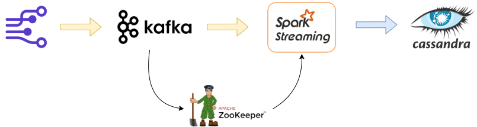

# Real-Time-ETL-with-Kafka-Spark-Cassandra
In this project real time data streams pipeline was developed to process data produced by Kafka, processed by Spark in batches, and stored in Cassandra databases.

## Architecture

The real-time messages are pushed by a python script. The data is then produced by Kafka in the distributed system under a given topic. The produced data is consumed in real time by a consumer by listening to that specific topic. Consumer uses spark to losten to the streaming data. Once the data is received in batches, the spark push the data to Cassandra database. 

Below is the architecture of the end-to-end streaming pipeline.

<p align="center">
	
</p>

## Producer

To produce syntheic data, Faker library is used that generates fake data which will later be sent to the producers. The format of the produced data is shown below

```

# importing the faker library
from faker import Faker

# creating the instance of the class
faker = Faker()

# function to generate synthetic data
def get_registered_user():
	return faker.name()+"$"+faker.address()+"$"+faker.year()

```

The data is produced using KafkaProduce library in Python on registered_user_2 topic.

```

# calling the class instance for the Kafka producer
producer = KafkaProducer(bootstrap_servers=['localhost:9092'],value_serializer=json_serializer)

# producing the data in the topic
producer.send("registered_user_2",registered_user)
		
```


## Consumer


